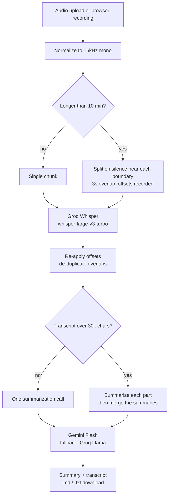

# Voice notes → transcript + summary

Upload or record a voice note in Bangla or English and get back a timestamped
transcript plus a structured summary — key points, decisions and action items —
that you can download as Markdown or plain text.

**Live demo:** _(add your Hugging Face Space URL here after deploying — see [Deployment](#deployment))_

Runs entirely on free API tiers. No paid services, no GPU, no database.

<!-- Record a short screen capture of a real recording being processed and save
     it as docs/demo.gif, then uncomment:

-->

---

## How well does it actually work on Bangla?

Anyone can wire Whisper to a summarizer in an afternoon. Almost nobody measures
whether it works on their language. Whisper's Bangla performance is
substantially worse than its English performance and is rarely quantified in
public, so this project measures it.

`eval/run_eval.py` scores the pipeline against human-written reference
transcripts and reports **WER** (word error rate) and **CER** (character error
rate). Lower is better.

### The headline: model choice decides whether Bangla works at all

<!-- EVAL_TABLE_START -->
21 clips, language auto-detected (`auto`) or forced to Bangla (`bn`). Lower is
better.

| Condition | Clips | turbo (auto)<br/>WER / CER | turbo (bn)<br/>WER / CER | large-v3 (auto)<br/>WER / CER | large-v3 (bn)<br/>WER / CER |
|---|---|---|---|---|---|
| Clean Bangla | 7 | 108.7% / 97.2% | 90.0% / 44.3% | 66.8% / **27.9%** | 66.8% / **22.2%** |
| Bangla + noise | 7 | 119.0% / 96.5% | 94.1% / 46.5% | 74.1% / 26.9% | 74.1% / 26.9% |
| English (baseline) | 7 | 6.1% / 3.6% | 59.2% / 53.3% | 4.5% / **3.0%** | 106.0% / 98.0% |

**Which script the output was actually written in** (Bangla clips only):

| System | Bengali script | Wrong script produced instead |
|---|---|---|
| `whisper-large-v3-turbo` (auto) | **0 / 14** | Gujarati, Tamil, Devanagari, Latin, empty |
| `whisper-large-v3-turbo` (bn) | 13 / 14 | empty |
| `whisper-large-v3` (auto) | 13 / 14 | Sinhala |
| `whisper-large-v3` (bn) | **14 / 14** | — |
<!-- EVAL_TABLE_END -->

**Whisper's Bangla problem is not that it mishears — it is that it does not
realise the audio is Bangla.** On `whisper-large-v3-turbo`, not one of 14 Bangla
clips came back in the Bengali script. It confidently transcribed Bangla speech
into Gujarati, Tamil, Devanagari, and in one case something close to Icelandic:

> reference: `আমি তোমার কষ্টটা বুঝছি, কিন্তু এটা সঠিক পথ না।`
> turbo:     `Ámi þóma kosteirta búð, sig en þú eða svað þig pár þána.`

Any error metric scores that as near-total failure, and it is — but the cause is
language identification, not acoustics. Give the same model the same audio and
tell it the language, and CER falls from 97% to 44%. Give the *full* `large-v3`
model the same audio with no hint at all, and it gets the language right 13 times
out of 14 at 27.9% CER.

**Three things follow from this, and all three are in the code:**

1. **The default model is `whisper-large-v3`, not `-turbo`.** Turbo is quicker
   and fine for English, but a transcript in the wrong alphabet is worthless
   however fast it arrived. This is the single highest-impact decision in the
   project and it is invisible without measuring.
2. **The sidebar has a language override.** Forcing Bangla still buys a further
   27.9% → 22.2% CER on clean speech, and rescues the cases where detection
   slips.
3. **Auto-detect stays the default and the override is per-recording.** Forcing
   Bangla globally would be a disaster for English — look at the English column
   under `(bn)`: 3.0% → 98.0% CER.

**How much worse is Bangla than English, honestly?** On the same pipeline, same
day, same code: **3.0% CER on English against 22.2% on clean Bangla** — roughly
seven times the character error rate, on read speech under good conditions.

**Why CER and not WER.** Bangla WER stays around 67% even where CER is 22%. Bangla
is richly inflected, so a transcription that gets a case ending slightly wrong
counts as a completely wrong word under WER while remaining perfectly readable.
WER is the wrong instrument here; it is reported for completeness only.

**Noise costs less than expected** — 27.9% → 26.9% CER, which is inside the noise
on 7 clips (one clean clip where detection slipped to Sinhala accounts for most
of the gap). White noise at 10 dB SNR is a gentler test than a real café.

### What these numbers do and don't cover

The Bangla clips come from
[Bengali.AI crowdsourced speech](https://huggingface.co/datasets/arif11/Bengali_AI_Speech)
— Bangladeshi Bangla, which is the variety this app is actually for. The English
baseline is LibriSpeech. Both ship a human-written sentence with every clip,
which is what makes this reproducible: `--fetch` rebuilds the exact clip set
through Hugging Face's rows API, with no authentication and a few megabytes of
download.

Scoring normalizes Unicode to NFC first. This is not optional for Bangla — the
same visible character has several valid encodings, and without it two identical
strings score as completely different.

**Limits worth stating plainly:**

- 7 clips per condition is enough to catch a 97%-vs-28% difference and nowhere
  near enough to separate 27.9% from 26.9%. Treat single-digit gaps as noise.
- The clips are short (3–15s) read speech. Spontaneous phone recordings with
  crosstalk will be worse.
- The noisy condition is synthetic white noise, not real room acoustics.
- **Code-switched Bangla-English has no usable public dataset with references**,
  so that condition is unmeasured — which is a shame, because it is the case
  this app is most likely to meet and the one Whisper is most likely to fail.
  Record clips into `eval/samples/code_switched/` with references alongside and
  the harness picks them up.

---

## Architecture



---

## Key decisions

### Hosted ASR instead of running Whisper locally

Hugging Face's free tier is a slow CPU with no GPU. A 10-minute recording on
`whisper-base` there takes several minutes, and larger models are worse — users
assume the app has frozen. Groq serves Whisper on custom inference hardware and
returns results many times faster than real time.

Measured on this pipeline: **a 30-minute recording transcribed in 21.8 seconds,
about 83x real time**, across 4 API calls, on `whisper-large-v3`. The faster
`-turbo` model does the same file in 12.5 seconds but cannot be trusted with
Bangla — see the evaluation above.

`faster-whisper` is built in as a config-switchable fallback (`ASR_PROVIDER=local`)
for offline development and as the baseline in the evaluation above. It is not
installed by default because it pulls several hundred MB of `ctranslate2`,
`onnxruntime` and `av` that the hosted app never touches — `pip install -r
requirements-dev.txt` gets it.

### Splitting long audio without cutting words in half

Whisper is sent at most 10 minutes at a time, because Groq's free tier rejects
uploads over 25MB.

Two details do most of the work here:

**Normalize first.** Converting to 16kHz mono before anything else shrinks a
stereo 44.1kHz recording by roughly 6x. Whisper resamples to 16kHz internally
anyway, so this costs nothing in accuracy and frequently drops a file under the
size limit that would otherwise have needed splitting. Chunks are uploaded as
FLAC, which is lossless and about half the size of the equivalent WAV — a
10-minute chunk lands near 5MB against a 25MB ceiling.

**Cut in the silence, not on the stopwatch.** Splitting at exactly 10:00 lands
mid-word and garbles the text at every seam. Instead the splitter searches ±30
seconds around each target boundary for a natural pause and cuts in the middle of
the nearest one, falling back to a hard cut only when there is no silence to find.

Chunks overlap by 3 seconds so a word sitting on a seam appears whole in at least
one of them, and every chunk records the offset it started at. **That offset is
the thing most likely to be silently wrong**: Whisper timestamps every clip from
zero, so a chunk starting at 10:00 reports its first word at 0:00, and without
adding the offset back every timestamp after the first chunk is wrong. It is
invisible on a short file and obvious on a long one. The overlap is then removed
by finding the longest run of words shared between the end of one chunk and the
start of the next.

### Summarizing transcripts longer than one prompt

Under 30,000 characters, one call. Over it, **map-reduce**: summarize each part
separately, then merge those summaries with an instruction to deduplicate
repeated points and preserve every action item.

Truncation is not an option here. A user who uploads an hour-long meeting and
gets a summary of the first ten minutes has been handed something *worse* than
nothing, because it looks complete.

### Two providers, two quotas

Groq transcribes and Gemini summarizes, so the two halves of the pipeline draw on
separate free-tier quotas. If the summarization provider is throttled or down,
the app fails over to the other one automatically and tells you it did.

This is not hypothetical — it was built after every Gemini Flash model returned
`503 high demand` during development. Retries back off 1s, 2s, 4s, 8s, and cover
`503`/`500`/timeouts as well as `429`, because on a free tier a provider briefly
falling over is as routine as being rate limited.

---

## Known limitations

- **Accuracy drops on noisy audio.** See the noise column in the table above.
  Background conversation and phone-quality recordings are meaningfully harder.
- **No speaker separation.** A two-person conversation comes back as one
  undifferentiated transcript. Diarization is the obvious next step.
- **Code-switched speech is the weak spot.** Whisper's language detection is
  unreliable on Bangla-English mixing; use the language override in the sidebar
  when it guesses wrong.
- **Free-tier rate limits are real.** Sustained use will hit them. The app
  retries and fails over, but it can still run out of room.
- **Storage is ephemeral.** Nothing is retained between sessions — which is a
  genuine privacy feature, not just a limitation.
- **Free-tier inputs may be used for model improvement** by the providers. Do not
  upload confidential recordings.

---

## Local setup

From a clean clone:

```bash
git clone <your-repo-url>
cd voice-notes-summarizer

python -m venv .venv
source .venv/bin/activate        # Windows: .venv\Scripts\activate

pip install -r requirements.txt

cp .env.example .env             # then add your two API keys
streamlit run app.py
```

Both keys are free and need no credit card:

- `GROQ_API_KEY` — <https://console.groq.com/keys>
- `GEMINI_API_KEY` — <https://aistudio.google.com/apikey>

**ffmpeg** is required to decode anything other than a plain WAV. You do not have
to install it separately: `imageio-ffmpeg` ships a static binary and the app
finds it automatically, preferring a system ffmpeg if one exists.

For tests, the local ASR fallback, and the evaluation:

```bash
pip install -r requirements-dev.txt
pytest
```

---

## Deployment

Hugging Face Spaces, free CPU tier.

1. Create a Space at <https://huggingface.co/new-space> with **SDK = Streamlit**
   and hardware **CPU basic (free)**.
2. Push this repo to it:

   ```bash
   git init                          # if not already a repo
   git add .                         # .env is gitignored — check `git status`
   git commit -m "Voice notes summarizer"
   git remote add space https://huggingface.co/spaces/<user>/<space-name>
   git push space main
   ```

   Spaces auto-detects `requirements.txt`, `packages.txt` and `app.py`, and reads
   the YAML block at the top of this README for its configuration.
3. Add `GROQ_API_KEY` and `GEMINI_API_KEY` under
   **Settings → Variables and secrets → Repository secrets**. Never commit `.env`.
4. **Upload an mp3 as your first test.** If it fails to decode, `packages.txt` is
   missing or misnamed — that file installs ffmpeg and is not optional. (Locally
   the bundled `imageio-ffmpeg` covers this, so a missing `packages.txt` will not
   show up until you deploy.)
5. Put the resulting URL in the **Live demo** line at the top of this README.

Storage on Spaces is ephemeral: nothing you upload is retained between sessions.

---

## Project layout

```
app.py                  Streamlit UI and session handling — deliberately thin
src/
  audio.py              load, normalize, split on silence
  transcribe.py         Groq + faster-whisper behind one interface; stitching
  summarize.py          prompts, map-reduce, provider fallback
  formatting.py         timestamps, markdown and plain-text export
  config.py             every tunable value and env var
eval/
  run_eval.py           WER/CER against reference transcripts
tests/                  audio, formatting, stitching, summarization, UI
packages.txt            ffmpeg, for Hugging Face Spaces
```

All logic lives in `src/` so it can be tested without launching Streamlit.

## Configuration

Everything tunable is in [`src/config.py`](src/config.py) and can be overridden
by environment variable. The ones worth knowing:

| Variable | Default | Purpose |
|---|---|---|
| `ASR_PROVIDER` | `groq` | `groq` or `local` (faster-whisper) |
| `GROQ_ASR_MODEL` | `whisper-large-v3-turbo` | Hosted Whisper model |
| `LOCAL_ASR_MODEL` | `small` | faster-whisper size |
| `LLM_PROVIDER` | `gemini` | `gemini` or `groq` |
| `GEMINI_MODEL` | `gemini-flash-latest` | Rolling alias for current Flash |
| `GROQ_MODEL` | `llama-3.3-70b-versatile` | Used on fallback |
